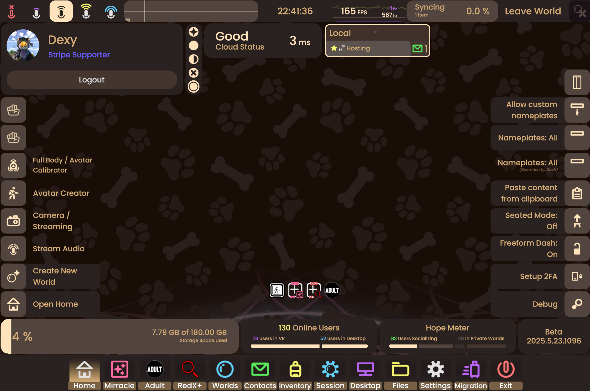
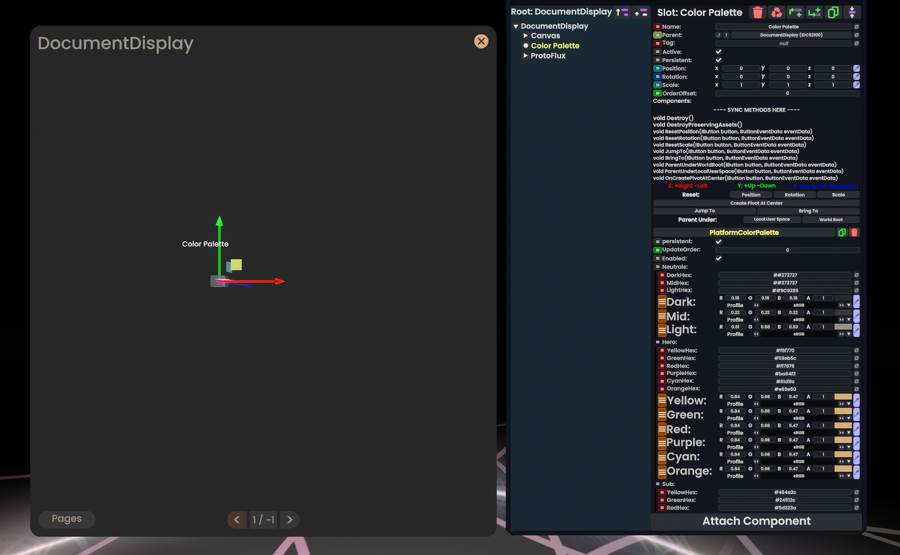
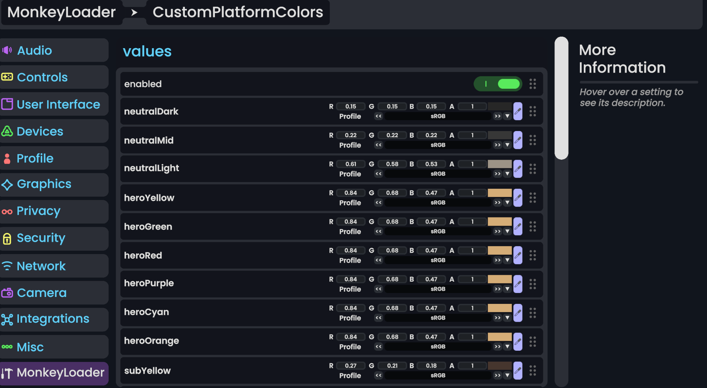

CustomPlatformColors

*Woof woof!* A [ResoniteModLoader](https://github.com/resonite-modding-group/ResoniteModLoader) mod for [Resonite](https://resonite.com/) that lets you customize your platform's color scheme! 🎨

| Dashboard | UIX | Settings |
|:-------------:|:-------------:|:-------------:|
|  |  |  |

## 🦴 Features

- Customize all platform UI colors
- Change neutral, hero, and accent colors
- Personalize button and text appearances
- Live color updates without restart
- Easy configuration through mod settings

## 🐕 Installation

1. Install [ResoniteModLoader](https://github.com/resonite-modding-group/ResoniteModLoader)
2. Drop `CustomPlatformColors.dll` into your `rml_mods` folder
3. Launch Resonite and check logs to verify installation

## 🎾 Configuration

Customize these color groups:

| Category | Description |
|----------|-------------|
| Neutral Colors | Background and UI base colors |
| Hero Colors | Primary accent and highlight colors |
| Sub Colors | Secondary UI element colors |
| Dark Colors | Darker variants for contrast |
| Button Colors | Interactive element appearances |

## 🐾 Tips & Tricks

- Colors update in real-time - no restart needed!
- Use the mod configuration menu to preview changes
- Save your favorite color schemes
- Share configurations with friends

## 📝 Notes

- All changes are local to your client
- Compatible with other UI mods
- Colors persist between sessions

---

*Happy customizing! Bark bark!* 🐕

Made with 💖 by Dexy
