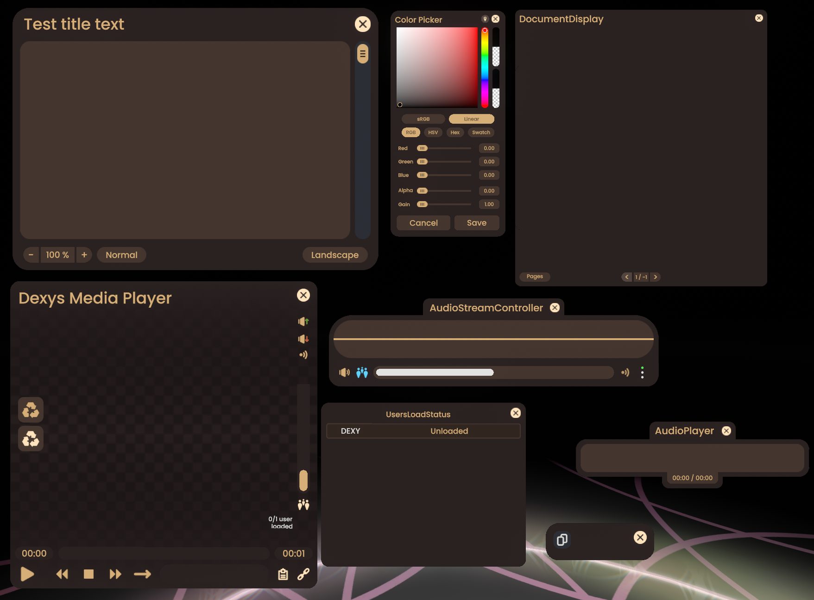

CustomPlatformColors

*Woof woof!* A [ResoniteModLoader](https://github.com/resonite-modding-group/ResoniteModLoader) mod for [Resonite](https://resonite.com/) that lets you customize your platform's color scheme! 🎨

## 🖼️ Screenshots

| Home | UIX | Settings |
|:-------------:|:-------------:|:-------------:|
|  |  |  |

| Worlds | Inventory | Files | 
|:-------------:|:-------------:|:-------------:|
|  |  |  |

| Contacts | Session | Modified PlatformColorPalette |
|:-------------:|:-------------:|:-------------:|
|  |  | 

## ⚠️ Important Notice

**This mod primarily focuses on local user interface elements.** All color customizations are **client-side only** and will only be visible to you. Other users will not see your custom colors, and any UI elements outside of your local user interface (such as world objects, other users' content, or shared interface elements) remain unchanged.

**For elements outside of local user space:** This mod applies a **local-only override** to the `<PlatformColorPalette>` Component for any elements that use it. This override is **only local** - other users will still see the default platform colors even if those elements use the platform color palette.

## 🦴 Features

- Customize all platform UI colors
- Change neutral, hero, and accent colors
- Personalize button and text appearances
- Live color updates without restart
- Easy configuration through mod settings

## 🐕 Installation

1. Install [ResoniteModLoader](https://github.com/resonite-modding-group/ResoniteModLoader)
2. Drop `CustomPlatformColors.dll` into your `rml_mods` folder
3. Launch Resonite and check logs to verify installation

| Worlds - Seachbar | Worlds - PaginingControl | Worlds - Filter | Settings Facet |
|--------------|--------------|--------------|--------------|
 `resrec:///U-1NWSXyNbyjY/R-f2721f5d-c850-4955-bb0e-2775533413db` |  `resrec:///U-1NWSXyNbyjY/R-de9d3dda-a9c8-4861-a5c4-c718b7fc7495` |  `resrec:///U-1NWSXyNbyjY/R-d64cf878-7a3f-4ad6-b6bb-6cee3945ba5d` |  `resrec:///U-1NWSXyNbyjY/R-20b23e90-ea58-4447-a621-7454a996e098`

## 🎾 Configuration

### **Core Settings**
| Setting | Type | Description | Default |
|---------|------|-------------|---------|
| `enabled` | Boolean | Should the mod be enabled | `true` |

### **Neutral Colors**
| Setting | Type | Description | Default |
|---------|------|-------------|---------|
| `neutralDark` | Color | Dark neutral color | Default dark |
| `neutralMid` | Color | Mid neutral color | Default mid |
| `neutralMidLight` | Color | Mid-Light neutral color | Default mid-light |
| `neutralLight` | Color | Light neutral color | Default light |

### **Hero Colors (Primary Colors)**
*These colors automatically generate Mid/Sub/Dark variants*

| Setting | Type | Description | Default |
|---------|------|-------------|---------|
| `heroYellow` | Color | Hero yellow color | Default yellow |
| `heroGreen` | Color | Hero green color | Default green |
| `heroRed` | Color | Hero red color | Default red |
| `heroPurple` | Color | Hero purple color | Default purple |
| `heroCyan` | Color | Hero cyan color | Default cyan |
| `heroOrange` | Color | Hero orange color | Default orange |

### **Color Generation Settings**
| Setting | Type | Description | Default |
|---------|------|-------------|---------|
| `midSaturationFactor` | Float | Mid saturation factor | `0.45` |
| `midBrightnessFactor` | Float | Mid color brightness factor (0.0-1.0) | `0.501` |
| `subSaturationFactor` | Float | Sub saturation factor | `0.75` |
| `subBrightnessFactor` | Float | Sub color brightness factor (0.0-1.0) | `0.247` |
| `darkBrightnessFactor` | Float | Dark color brightness factor (0.0-1.0) | `0.165` |
| `darkSaturationFactor` | Float | Dark saturation factor | `0.25` |

### **UI Button Colors**
| Setting | Type | Description | Default |
|---------|------|-------------|---------|
| `browserBackgroundColor` | Color | Browser background color | Default background |
| `buttonTextColor` | Color | Button text color | Default text |
| `buttonNormalColor` | Color | Button normal color | Default button |
| `buttonHoverColor` | Color | Button hover color | Tinted button |
| `buttonPressColor` | Color | Button press color | Tinted button |
| `buttonDisabledColor` | Color | Button disabled color | Default disabled |

### **Dashboard Colors**
| Setting | Type | Description | Default |
|---------|------|-------------|---------|
| `patchRadiantDashButton` | Boolean | Patch dashboard buttons | `true` |
| `patchRadiantDashScreen` | Boolean | Patch dashboard screens | `true` |
| `patchUserspaceRadiantDash` | Boolean | Patch userspace dashboard | `true` |
| `patchUserspaceScreensManager` | Boolean | Patch screen manager | `true` |
| `dashAccentColor` | Color | Dashboard accent color | `(0.5, 0.5, 1.0, 1.0)` |
| `dashBorderColor` | Color | Dashboard border color | White × 1.5 |
| `dashTransparentBackground` | Boolean | Use transparent dashboard background | `false` |
| `dashBackgroundColor` | Color | Dashboard background color | Default background |
| `dashScreenBackgroundColor` | Color | Dashboard screen background color | Default BG with 96.5% alpha |
| `dashButtonColor` | Color | Dashboard button color | Default button |
| `dashButtonHoverColor` | Color | Dashboard button hover color | Default button × 0.9 |
| `dashButtonDisabledColor` | Color | Dashboard button disabled color | Default disabled |
| `dashButtonTextColor` | Color | Dashboard button text color | White |
| `dashScreenColor` | Color | Dashboard screen color | `(0.3, 0.6, 1.0)` |

### **World Preset Colors**
| Setting | Type | Description | Default |
|---------|------|-------------|---------|
| `patchWorldPresets` | Boolean | Patch world grid/platform colors | `true` |
| `gridBackgroundColor` | Color | Grid background color | `(0.07, 0.08, 0.11)` |
| `gridMinorLinesColor` | Color | Grid minor lines color | `(0.17, 0.18, 0.21)` |
| `gridMajorLinesColor` | Color | Grid major lines color | `(0.88, 0.88, 0.88)` |
| `platformColor` | Color | Platform color | `(0.5, 0.5, 0.5)` |

### **Inventory Colors**
*Auto-generated from Hero Colors for consistency*

| Setting | Type | Description | Default |
|---------|------|-------------|---------|
| `patchInventoryBrowser` | Boolean | Patch inventory browser | `true` |
| `inventoryTransparentDeselected` | Boolean | Use transparent background for deselected items | `false` |

### **Custom Dashboard Background**
| Setting | Type | Description | Default |
|---------|------|-------------|---------|
| `customDashBackgroundTexture` | URI | Custom dashboard background texture URL | `resonite-data:///` |
| `useCustomDashBackground` | Boolean | Use custom background texture | `false` |

---

**Note:** All colors automatically generate Mid, Sub, and Dark variants based on your Hero colors and generation settings.

---

*Happy customizing! Bark bark!* 🐕

Made with 💖 by Dexy
